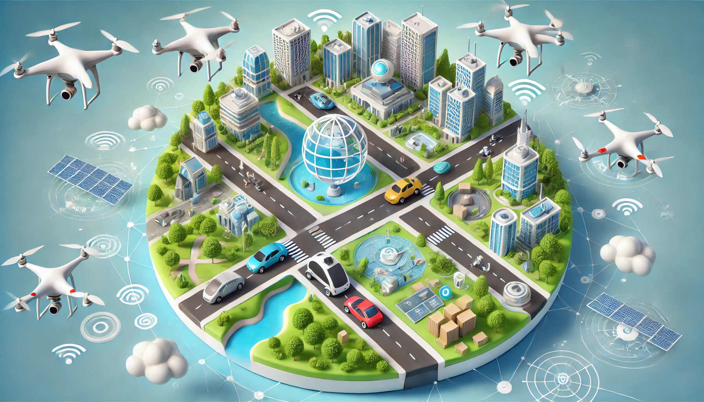
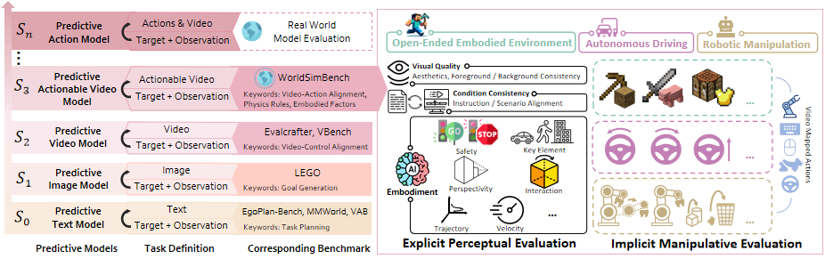

 

<h1 align="center"><strong>Paper list for World Model</strong></h1>

#### We appreciate any useful suggestions for improvement of this paper list or survey from peers. Please raise issues or send an email to **yiranqin@link.cuhk.edu.cn**. Thanks for your cooperation! We also welcome your pull requests for this project!
 

  

## 🏠 About

Before taking action, humans make predictions based on their objectives and observations of the current environment. These predictions manifest in various forms, \eg, textual planning, visual imagination of future scene changes, or even subconscious planning at the action level. Each of these predictive capabilities is critical to the successful completion of tasks. With the development of generative models, agents driven by these models are exhibiting predictive capabilities that enable them to complete embodied tasks by making human-like predictions, high-level planning, image-based guidance, or future video prediction to drive actions. We refer to these models as World Models. Recently, these models have been widely applied across various domains spanning from developing agents to solve inference tasks to leveraging predictions for driving robots to perform specific actions.

## :collision: Update Log 

* [2024.12.10] We release the first version of the paper list for Embodied AI. This page is continually updating!

## <a id="table-of-contents">📚 Table of Contents </a>

- [Books & Surveys](#books-surveys)
- [Foundation Model](#Foundation-Model)
- [General World Model](#General-World-Model)
- [Autonomous Driving](#Autonomous-Driving)
- [Robot Manipulation](#Robot-Manipulation)
- [Indoor Navigation](#Indoor-Navigation)
- [World Model Safty](#World-Model-Safty)
- [Social Simulation](#Social-Simulation)
- [Multi-Agent World Model](#Multi-Agent)

## <a id="books-surveys"> Books & Surveys <a href="#table-of-contents">🔝</a> </a> 

* **Multimodal Large Models: The New Paradigm of Artificial General Intelligence**, Publishing House of Electronics Industry (PHE), 2024       
Yang Liu, Liang Lin             
[[Page](https://hcplab-sysu.github.io/Book-of-MLM/)]      

## <a id="Foundation-Model"> Foundation Model <a href="#table-of-contents">🔝</a> </a>
### Text Generation
### Image Generation
### Video Generation

## <a id="General-World-Model"> General World Model <a href="#table-of-contents">🔝</a> </a> 

General World Model aims at representing and simulating wide range of situations and interactions, especically those encountered in the real world.

* **Gen-2: Generate novel videos with text, images or video clips**. [[website](https://runwayml.com/research/gen-2)]
* **Gen-3 Alpha: A New Frontier for Video Generation**. [[website](https://runwayml.com/research/introducing-gen-3-alpha)]
* **Pandora: Towards General World Model with Natural Language Actions and Video States**. [[paper](https://arxiv.org/pdf/2406.09455)]
* **Mastering Diverse Domains through World Models**. [[paper](https://arxiv.org/pdf/2301.04104)]
* **TD-MPC2: Scalable, Robust World Models for Continuous Control**. [[paper](https://arxiv.org/pdf/2310.16828)]
* **Learning Interactive Real-World Simulators**. [[paper](https://ai-data-base.com/wp-content/uploads/2023/10/2310.06114_compressed.pdf)]
* **SafeDreamer: Safe Reinforcement Learning with World Models**. [paper](https://arxiv.org/pdf/2307.07176)
* **Is Sora a World Simulator? A Comprehensive Survey on General World Models and Beyond**. [[paper](https://arxiv.org/pdf/2405.03520)]

## <a id="Autonomous-Driving"> Autonomous Driving <a href="#table-of-contents">🔝</a> </a> 

## <a id="Robot-Manipulation"> Robot Manipulation <a href="#table-of-contents">🔝</a> </a> 

## <a id="Indoor-Navigation"> Indoor Navigation <a href="#table-of-contents">🔝</a> </a> 

* **Pathdreamer: A World Model for Indoor Navigation**. [[paper](https://openaccess.thecvf.com/content/ICCV2021/papers/Koh_Pathdreamer_A_World_Model_for_Indoor_Navigation_ICCV_2021_paper.pdf)]
* **Panogen: Text-conditioned panoramic environment generation for vision-and-language navigation**. [[paper](https://proceedings.neurips.cc/paper_files/paper/2023/file/4522de4178bddb36b49aa26efad537cf-Paper-Conference.pdf)]
* **Dreamwalker: Mental planning for continuous vision-language navigation**. [[paper](https://openaccess.thecvf.com/content/ICCV2023/papers/Wang_DREAMWALKER_Mental_Planning_for_Continuous_Vision-Language_Navigation_ICCV_2023_paper.pdf)]

## <a id="World-Model-Safty"> World Model Safty <a href="#table-of-contents">🔝</a> </a> 
### Safety Evaluation

### Safety Benchmark
SPA-VL: A Comprehensive Safety Preference Alignment Dataset for Vision Language Model[[paper](https://arxiv.org/abs/2406.12030)]

SafeBench: A Benchmarking Platform for Safety Evaluation of Autonomous Vehicles[[paper](https://proceedings.neurips.cc/paper_files/paper/2022/file/a48ad12d588c597f4725a8b84af647b5-Paper-Datasets_and_Benchmarks.pdf)]

### Attack
From LLMs to MLLMs: Exploring the Landscape of Multimodal Jailbreaking[[paper](https://arxiv.org/abs/2406.14859)]
Agent Smith: A Single Image Can Jailbreak One Million Multimodal LLM Agents Exponentially Fast[[paper](https://arxiv.org/abs/2402.08567)]

### Safety enhancement
MLLM-Protector: Ensuring MLLM's Safety without Hurting Performance[[paper](https://arxiv.org/abs/2401.02906)]

## <a id="Social-Simulation"> Social Simulation <a href="#table-of-contents">🔝</a> </a> 

## <a id="Multi-Agent"> Multi-Agent World Model <a href="#table-of-contents">🔝</a> </a> 

   

 

## 👏 Acknowledgements

